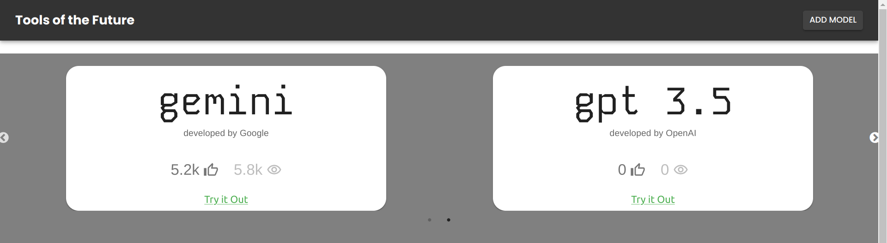
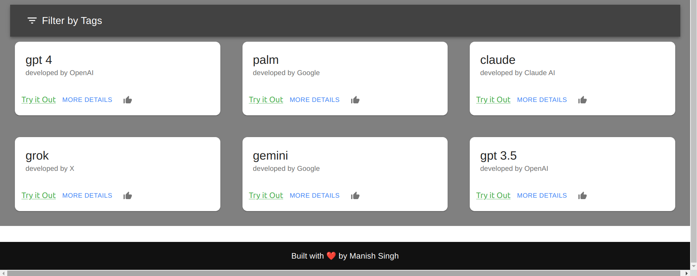
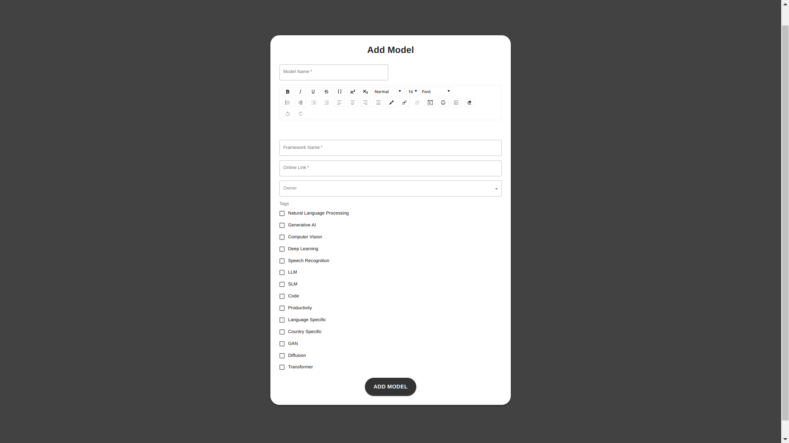
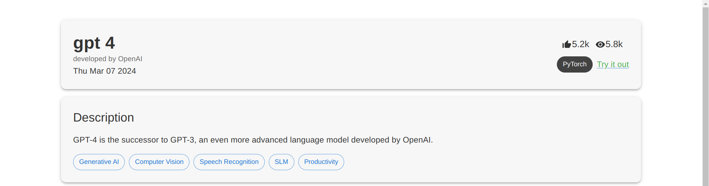
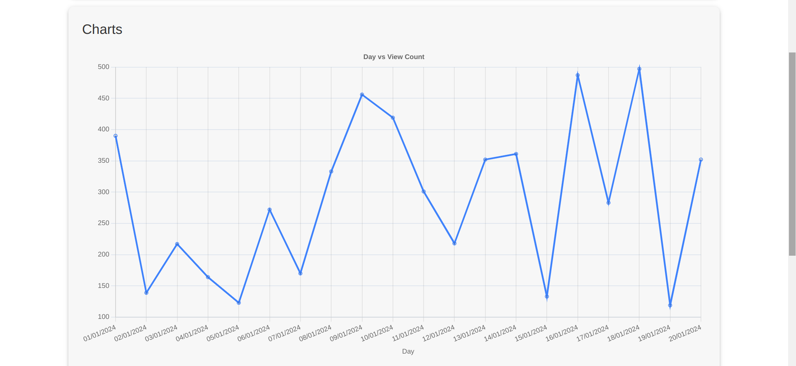
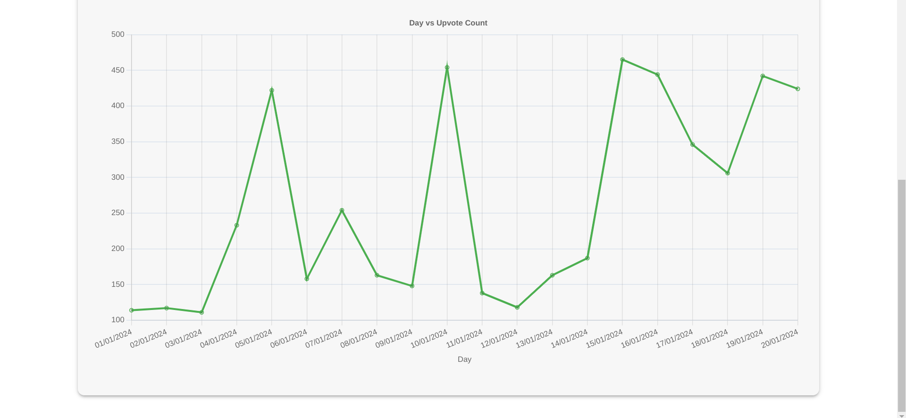

### Tools of the Future 

#### Overview
This project is a web application built with React for the frontend and Django for the backend. It provides a platform for users to view and interact with various models. The application consists of three main pages: Home Page, Add Model Page, and Model Details Page.

#### Features
- **Home Page:**
  - Displays a carousel of featured models for an aesthetically pleasing showcase.
  - Lists all available models for users to browse through.
  - Provides filtering options based on tags to help users find models of interest.
  - 
  - 
  
- **Add Model Page:**
  - Allows users to create and submit a new model, which will be dynamically added to the Home Page.
  - Includes form validation to ensure accurate model submissions.
  - 

- **Model Details Page:**
  - Presents detailed information about a selected model, including its framework, total views, and upvotes.
  - Offers a comprehensive description that includes code snippets and other relevant details.
  - Visualizes data with a chart illustrating the day-wise view and upvote count trends.
  - Enables users to upvote the model and increments the view count each time a user visits the Model Details Page.
  - 
  - 
  - 

#### Backend Repository
The Django backend for this project is available on GitHub at [astromanish/atlan-backend](https://github.com/astromanish/atlan-backend).

#### Installation
Follow these steps to set up and run the application locally:
1. Clone the repository: `git clone https://github.com/astromanish/genai-marketplace.git`
2. Navigate to the project directory: `cd genai-marketplace`
3. Install dependencies: `npm install`
4. Start the development server: `npm start`
5. Access the application through the provided URL.

#### Usage
- Upon accessing the application, navigate through the different pages using the intuitive navigation bar.
- Explore the Home Page to discover featured models and browse through the entire collection.
- Utilize the filtering feature to narrow down models based on specific tags.
- Add a new model effortlessly through the Add Model Page and witness its instant addition to the Home Page.
- Delve into the detailed information provided on the Model Details Page to gain insights into each model.
- Interact with the models by upvoting them and observing the real-time view count updates.
